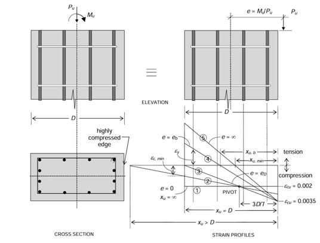
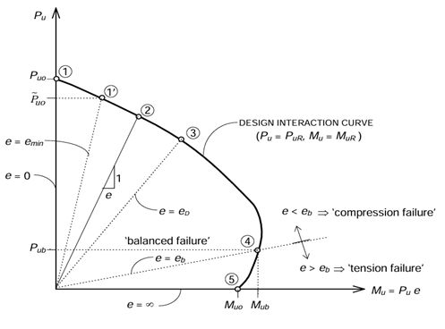
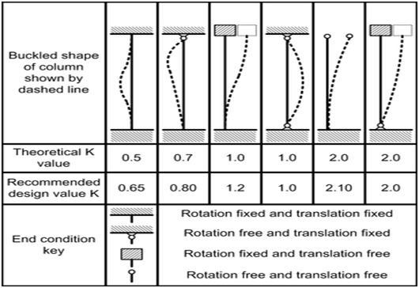

### Theory:
Short columns are RC columns with a slenderness ratio (ratio of effective length to least lateral dimension) less than a specific code limit (typically around 12). Their behaviour is governed by both axial compression and bending moment due to eccentricity of the applied load or inherent imperfections. 
 
Possible strain profiles under ultimate limit state in eccentriccompression.
### The design considers:

##### Equilibrium :  
Balancing the applied axial load (Pu) and bending moment (Mu) with the resisting forces and moments developed by the concrete and steel reinforcement.
##### Material Properties :
Characteristic compressive strength of concrete (fck) and characteristic yield strength of steel reinforcement (fy).
##### Interaction Diagrams :
These are code-provided charts that relate the axial load capacity (Pu) to the bending moment capacity (Mu) of a specific section for various reinforcement ratios.

### Interaction Curve

The ‘interaction curve’ is a complete graphical representation of the design strength of a uniaxially eccentrically loaded column of given proportions. Each point on the curve corresponds to the design strength values of (PuR)  and (MuR)  associated with a specific eccentricity (e) of loading. That is to say, if load P is applied on a short column with an eccentricity e, and if this load is gradually increased till the ultimate limit state (defined by the Code) is reached, and that ultimate load at failure is given by Pu = PuR and the corresponding moment by Mu = MuR = PuR e, then the coordinates (MuR, PuR)form a unique point on the interaction diagram.
The interaction curve defines the different (MuR, PuR) combinations for all possible eccentricities of loading 0 ≤ e < $$\infty$$. For design purposes, the calculations of MuRand PuR are based on the design stress-strain curves (including the partial safety factors), and the resulting interaction curve is sometimes referred to as the design interaction curve (which is different from the characteristic interaction curve). Using the design interaction curve for a given column section, it is possible to make a quick judgement as to whether or not the section is ‘safe’ under a specified factored load effect combination (Pu, Mu). If the point given by the coordinates (Mu, Pu) falls within the design interaction curve, the column is ‘safe’; otherwise, it is not. 
 
 Typical Pu -Mu Interaction Diagram
### Design Steps :

##### Define Design Parameters :
Specify the applied axial load (Pu) and bending moment (Mu) on the column.
Choose design values for concrete strength (fck) and steel yield strength (fy) based on material specifications and code requirements.
Select a desired concrete cover thickness for durability (refer to building codes).

##### Determine Column Dimensions :
Considering architectural constraints and spacing requirements, choose a preliminary rectangular or square cross-section for the column (b x h).
Check code provisions for minimum column dimensions.

##### Effective Length Calculation :
Based on the end support conditions (fixed, hinged, etc.), calculate the effective length (Le) of the column using code formulas.

#### Slenderness Ratio Check :

Calculate the slenderness ratio (Le/b) for the chosen dimensions.
Verify the slenderness ratio is less than the code limit for short column design.

#### Interaction Diagram Selection :

Refer to building codes and select an appropriate interaction diagram for the chosen concrete strength (fck) and reinforcement type. The diagram relates Pu and Mu capacity for various reinforcement ratios.

#### Strength Design :

Assume a trial reinforcement ratio within the allowed limits (typically 0.01 to 0.08).
Use the interaction diagram to find the corresponding Pu capacity for the chosen reinforcement and section dimensions (b, h).
If the Pu capacity from the diagram is less than the applied axial load (Pu), adjust the reinforcement ratio and repeat the process until a safe design is achieved (Pu capacity >= Pu and Mu capacity >= Mu).
#### Serviceability Check :
Depending on the code and project requirements, perform calculations to ensure the column deflection under service loads (including dead load) is within acceptable limits.
#### Reinforcement Details :
Determine the number and diameter of longitudinal steel bars required to achieve the calculated area of reinforcement (Asc).
Design and specify the spacing, diameter, and minimum requirements for lateral ties to ensure confinement of concrete and prevent buckling of steel bars.
#### Code Compliance Check :
Verify the final design meets all relevant code requirements for concrete cover, minimum bar spacing, fire resistance, etc
